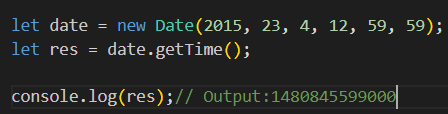
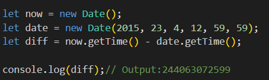

# Объект Date
## Объект Date - основной объект для работы с датами.
# Синтаксиc:

## Теперь переменная date - это объект с датой, который хранит в себе текущий момент времени (секунду, минуту, час и так далее). С помощью специальных функций мы можем получить нужные нам характеристики времени, например, текущий час, текущий день или текущий месяц.

### К примеру, текущий час можно получить так: date.getHours(), а текущий месяц - вот так date.getMonth(). Смотрите все варианты:

## Можно задать не текущий момент времени, а заданный. Для этого следует передать параметры в формате new Date(год, месяц, день, часы, минуты, секунды, миллисекунды) и в этом случае в переменную date запишется не текущий момент времени, а тот, который мы указали в параметрах Особенности такого формата: отсчет месяцев начинается с нуля, отсутствующие параметры, начиная с часов считаются равными нулю, а для года, месяцев и дней – единице.
# Пример 
## Давайте выведем текущие день, месяц и год в формате 'год-месяц-день' (месяц при этом будет на 1 меньше настоящего, так как нумерация месяцев с нуля):

# Метод getFullYear
## Метод getFullYear применяется к объекту с датой и возвращает год, состоящий из 4-х цифр.
# Пример 1
## Давайте выведем текущий год:

# Пример 2
## В данном примере будет выведен выбранный год:

# Метод getDate
## Метод getDate применяется к объекту с датой и возвращает номер текущего дня месяца. Нумерация дней начинается с 1.
# Пример 1
## Давайте выведем номер текущего дня:

# Пример 2
## Давайте выведем день указанной даты:

# Метод getDay
## Метод getDay применяется к объекту с датой и возвращает номер дня недели в виде числа от 0 до 6. Причем, воскресенье - это день номер 0, понедельник - 1 и т.д.
# Пример 1
## Давайте выведем номер текущего дня недели:

# Пример 2
## Давайте выведем день недели заданной даты:

# Метод Date.now
## Метод Date.now возвращает количество миллисекунд, прошедших с полуночи 1 января 1970 года до текущего момента. Такой формат даты называется timestamp.
# Пример 1
## Давайте выведем количество миллисекунд, прошедших с 1 января 1970 года:

# Метод getTime
## Метод getTime применяется к объекту с датой и возвращает количество миллисекунд, прошедших с полуночи 1 января 1970 года до заданного момента времени. Такой формат даты называется timestamp.
# Пример 1
## Давайте выведем количество миллисекунд с 1 января 1970 до текущего момента времени:

# Пример 2
## В данном примере будет выведено количество миллисекунд с 1 января 1970 до заданного момента времени:

# Пример 3
## Получим разницу в миллисекундах между текущим и заданным моментом времени:

# Метод getMonth
## Метод getMonth применяется к объекту с датой и возвращает текущий месяц. Нумерация месяцев начинается с нуля.
# Пример 1
## Давайте выведем номер текущего месяца:

# Пример 2
## Давайте выведем месяц за заданную дату:

# Метод getHours
## Метод getHours применяется к объекту с датой и возвращает значение текущего часа (число от 0 до 23).
# Пример 1
## Давайте выведем текущий час:

# Метод getMinutes
## Метод getMinutes применяется к объекту с датой и возвращает текущее значение минут (число от 0 до 59).
# Пример 1
## Давайте выведем текущее количество минут:

# Метод setFullYear()
## Метод setFullYear()устанавливает год объекта даты.
# Пример 1

# Метод setMonth()
## Метод setMonth()устанавливает месяц объекта даты (0-11):
